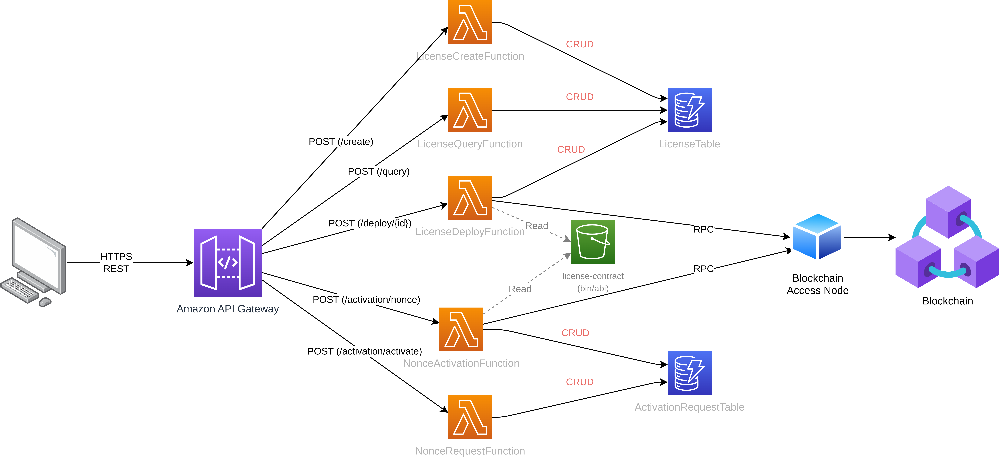

# Software Subscription and License Management System API

## Overview

This repository hosts the API for a blockchain-based software subscription and license management system. The API interacts with smart contracts on a blockchain to facilitate software license creation, deployment, query, and activation. The solution aims to provide a secure and efficient way to manage software subscriptions and licenses using blockchain technology.



## Getting Started

### Prerequisites

- Git
- AWS CLI
- An AWS account with proper permissions

### Clone the Repository

To get started, clone the repository to your local machine:

```sh
git clone git@github.com:BlockSHK/management-system-api.git
```

## Deploying the API

The API can be deployed to an AWS environment using the deployment script included in the repository:

```sh
./deploy.sh <aws-region>
```

Replace <aws-region> with the AWS region where you want to deploy the environment (e.g., us-east-1).

For additional usage details of the deployment script, you can use the following command:

```sh
./deploy.sh -h
```

Please note that the API requires access to the contract's bin/abi files. To upload these files, use the script located in contracts/solidity/upload.sh and run the following command:

```sh
cd contracts
./upload.sh <aws-region>
```

Make sure to use the correct S3 bucket naming convention, as AWS has a global naming standard.

## Architecture

The API and data model are described in the following resources:

- [Data Model](./documentation/model.md)
- [API Documentation](./documentation/api.md)

## Key API Endpoints

The Management System API includes several critical endpoints:

- License Creation: `POST /create`
- License Deployment: `POST /deploy/{id}`
- License Query: `POST /query/`
- Activation Nonce Generation: `POST /activation/nonce`
- License Activation: `POST /activation/activate`

These endpoints enable interaction with the blockchain and smart contracts to create, deploy, and query software licenses. Additionally, they allow users to generate nonces for activation and activate their licenses to access the software features.

More endpoints may be added in the future to enhance the functionality and capabilities of the management system.

## Contributing

Contributions are welcome! For major changes, please open an issue first to discuss what you would like to change. Please make sure to update tests as appropriate.

## License

This project is licensed under the Apache License 2.0. See the [LICENSE](https://github.com/BlockSHK/management-system-api/blob/main/LICENSE) file for details.

## Contact

If you have any questions or need further clarification, feel free to reach out to the contributors or open an issue on this repository.
